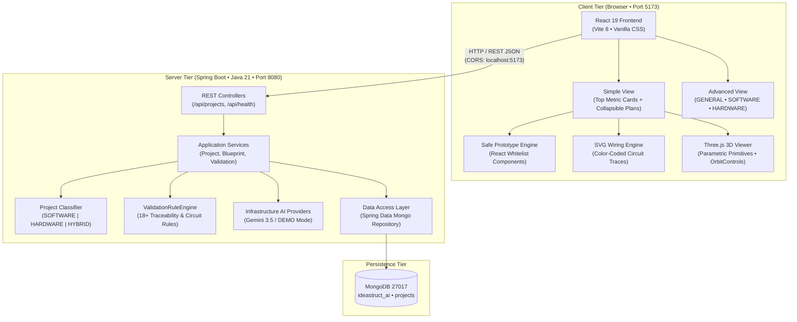

# IdeaStruct AI — System Architecture

IdeaStruct AI is an engineering planning workbench that converts natural-language product ideas into structured, traceable engineering blueprints spanning **Software**, **Hardware**, and **Hybrid** systems.

---

## 1. Core End-to-End Processing Architecture

```
USER IDEA
    │
    ▼
PROJECT CLASSIFIER
    │
    ├───────────────────────────────┐
    │                               │
 SOFTWARE                        HARDWARE
    │                               │
 SOFTWARE PLAN                   HARDWARE PLAN
    │                               │
 DEMO APP                        WIRING DIAGRAM
                                 + 3D MODEL
    │                               │
    └───────────────┬───────────────┘
                    │
                    ▼
            COMPLETE BLUEPRINT
                    │
                    ▼
               PLAN CHECK
```

> **Hybrid Projects:** For hybrid systems, both the software branch (architecture, API, database, interactive demo) and hardware branch (BOM, wiring diagram, parametric 3D model) are generated and cross-linked via the **Integration Architecture** pipeline.

---

## 2. High-Level Tier Architecture



---

## 3. Subsystem Architectural Details

### 3.1 Project Classifier (`ProjectClassifier.java`)
- Analyzes natural-language idea text and project titles.
- Evaluates vocabulary signals for physical electronics (sensors, microcontrollers, circuits, pins, motors) vs. digital software systems (web, apps, databases, APIs, authentication).
- Categorizes projects into:
  - `SOFTWARE`: purely digital applications.
  - `HARDWARE`: standalone physical electronics and embedded devices.
  - `HYBRID`: systems bridging physical devices to backend/mobile/web infrastructure.
- Outputs explanatory `reason` and confidence rating (`LOW | MEDIUM | HIGH`).

### 3.2 Safe Software Prototype Engine (`SafePrototypeEngine.jsx`)
- Zero arbitrary code execution: AI outputs structured JSON describing screens, layout, components, and action transitions.
- Strictly renders through a whitelist of safe React components:
  `Heading`, `Text`, `Button`, `Input`, `Textarea`, `Select`, `Card`, `List`, `Table`, `ImagePlaceholder`, `Navbar`, `Badge`, `StatCard`.
- Dispatches safe actions: `NAVIGATE`, `OPEN_MODAL`, `CLOSE_MODAL`, `SET_VALUE`, `SUBMIT_DEMO`, `SHOW_MESSAGE`, `FILTER_DEMO_DATA`, `SELECT_ITEM`, `BACK`.
- Supports desktop and mobile viewport toggles and flow resets. Zero `eval()`, `new Function()`, or raw HTML injection.

### 3.3 Deterministic Circuit Wiring Engine (`HardwareWiringDiagram.jsx`)
- Computes layout deterministically from validated `hardware.components` and `hardware.connections`.
- Arranges controller and peripheral components on a scalable SVG canvas with pin terminals.
- Renders color-coded signal traces according to signal type:
  - **Power (VCC):** Red (`#EF4444`)
  - **Ground (GND):** Slate / Black (`#64748B`)
  - **I2C:** Amber / Orange (`#F59E0B`)
  - **SPI:** Purple (`#8B5CF6`)
  - **Analog:** Green (`#10B981`)
  - **Digital / GPIO:** Cyan (`#06B6D4`)
- Interactive hover and click selection highlights connected paths and displays voltage levels.

### 3.4 Parametric 3D Hardware Prototype Engine (`Parametric3DViewer.jsx`)
- Built using Three.js with `OrbitControls` for full rotation, zoom, and pan.
- Renders parametric shapes based on structured placement instructions:
  - `BOARD`, `SENSOR_MODULE`, `DISPLAY_PANEL`, `LED`, `BUTTON`, `BUZZER`, `CONNECTOR`, `BOX`, `CYLINDER`, `GENERIC_MODULE`.
- Features interactive raycasting: clicking any 3D primitive highlights it and opens its component inspection card (name, purpose, category, pins).
- Includes an enclosure transparency toggle (`toggle enclosure`) and exploded view mode.
- Includes a graceful WebGL fallback alert if 3D hardware acceleration is unavailable.

### 3.5 Hybrid Integration Architecture (`HybridIntegrationSection.jsx`)
- For projects classified as `HYBRID`, models the end-to-end communication pipeline:
  `Physical Hardware Device ──► Communication Protocol (MQTT / HTTP / BLE / WebSocket) ──► Backend API ──► Database ──► Web/Mobile Dashboard`.
- Outlines data contracts, payload schemas, transmission frequencies, and network fault tolerance strategies.

### 3.6 Expanded Validation Rule Engine (`ValidationRuleEngine.java`)
Executes 18+ deterministic structural rules without non-deterministic AI evaluation:
- **General Rules:** Feature without requirement; requirement without implementation; missing estimate basis.
- **Software Rules:** Feature needs screen but screen missing; feature needs API but API missing; API references unknown role; screen references unknown feature; database references invalid collection.
- **Hardware Rules:**
  - `RULE_HW_MISSING_CONTROLLER`: Hardware system requires at least one microcontroller/microprocessor.
  - `RULE_HW_MISSING_POWER_SOURCE`: System requires a designated power supply component.
  - `RULE_HW_UNKNOWN_COMPONENT_REFERENCE`: Connection references an undefined component ID.
  - `RULE_HW_DUPLICATE_CONNECTION`: Multiple connections bridge the exact same pin terminals.
  - `RULE_HW_SENSOR_NO_CONTROLLER_PATH`: Sensor has no signal path reaching a controller.
  - `RULE_HW_MISSING_3D_MAPPING`: Hardware component has no corresponding 3D visualization primitive.
- **Hybrid Rules:**
  - `RULE_HYBRID_MISSING_INTEGRATIONS`: Hybrid project missing integration communication paths.

---

## 4. Security & Safety Model

1. **Zero Secret Leakage:** Gemini API keys are read strictly from backend environment variables (`GEMINI_API_KEY`). They are never exposed to the frontend or embedded in artifacts.
2. **Optimistic Concurrency:** Every project has a monotonic `revision` counter. Modifying requests pass `If-Match` or `expectedRevision`. Stale concurrent updates receive HTTP 409 Conflict.
3. **Prompt Injection Isolation:** Natural-language inputs are treated as untrusted data and enclosed in isolated prompt wrappers with strict schema output instructions.
4. **Mermaid & SVG Sanitization:** All user-supplied identifiers are sanitized before ER diagram generation; click handlers and raw HTML injections are disarmed under `securityLevel: 'strict'`.

